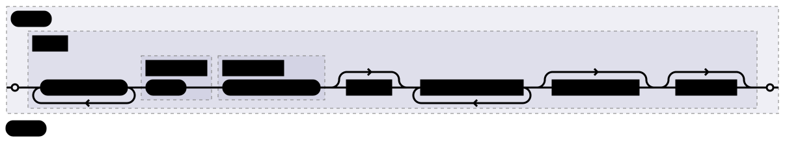
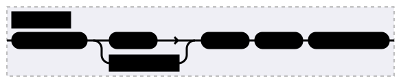
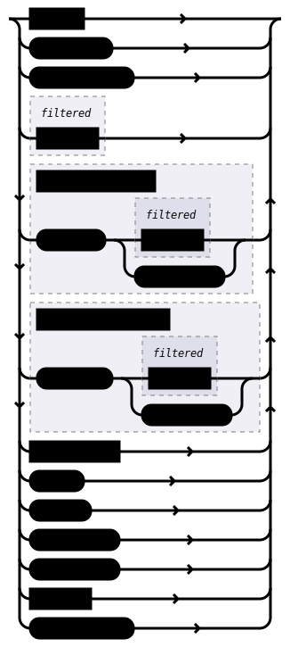
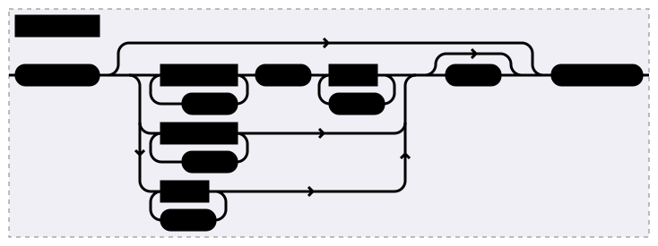
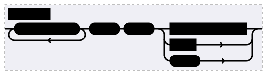
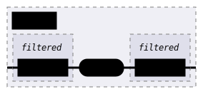
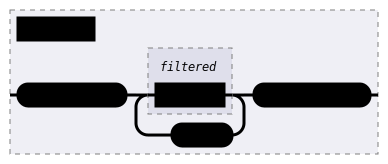

# Tokens & AST

The language is first lexed into tokens, out of which an abstract syntax tree (AST) is parsed.

## Tokens

The implementation of the lexer can be found at `compiler\dd-lexer`.

These are valid tokens in the language:

| Name                 | Pattern                                                     | Example       |
| -------------------- | ----------------------------------------------------------- | ------------- |
| Whitespace (skipped) | `r"[ \t\r\n]+"`                                             | ` `           |
| Comments (skipped)   | `r"//[^\n]*"`                                               | `// ...`      |
| DocCommentLine       | `r"///[^\n]*"`                                              | `/// ...`     |
| Ident                | `r"\p{XID_Start}[\p{XID_Continue}-]*"`                      | `Foo-bar`     |
| CurlyOpen            | `{`                                                         |               |
| CurlyClose           | `}`                                                         |               |
| BracketOpen          | `[`                                                         |               |
| BracketClose         | `]`                                                         |               |
| Comma                | `,`                                                         |               |
| Colon                | `:`                                                         |               |
| Underscore           | `_`                                                         |               |
| Arrow                | `->`                                                        |               |
| Star                 | `*`                                                         |               |
| Try                  | `try`                                                       |               |
| As                   | `as`                                                        |               |
| Allow                | `allow`                                                     |               |
| Default              | `default`                                                   |               |
| CatchAll             | `catch-all`                                                 |               |
| Stride               | `stride`                                                    |               |
| Num                  | `r"-?[0-9][_0-9]*"` (decimal)                               | `01_23`       |
| Num                  | `r"-?0b[_0-1]+"` (binary)                                   | `0b11_00`     |
| Num                  | `r"-?0o[_0-7]+"` (octal)                                    | `0o01_23`     |
| Num                  | `r"-?0x[_0-9a-fA-F]+"` (hexadecimal)                        | `0xAA_bb`     |
| Access               | `RW` / `RO` / `WO`                                          |               |
| ByteOrder            | `BE` / `LE`                                                 |               |
| BaseType             | `uint` / `int` / `bool`                                     |               |
| Integer              | `u8` / `u16` / `u32` / `u64` / `i8` / `i16` / `i32` / `i64` |               |
| AddressMode          | `mapped` / `indexed`                                        |               |
| String               | `r#""[^"]*""#`                                              | `"my string"` |

The tokens are lexed using [logos](https://crates.io/crates/logos).
The regexes are processed by the Rust Regex crate.

Direct tokens have priority over regexed tokens.

## Abstract syntax tree

The implementation of the parser can be found at `compiler\dd-parser`.

The tokens are parsed through multiple sub-parsers into nodes.
The AST is one node acting as the root.

The railroad diagrams and ebnf are generated by [chumsky](https://crates.io/crates/chumsky)
and is known to not be 100% correct/complete. Contributions there are encouraged!

The parsed numbers are parsed into a specific type of integer which is displayed in the diagrams.
Their sizes are mostly implementation details, with the exception of numbers parsed as bytes.

### Node


```
{{#include ../gen-docs/parser/node.ebnf}}
```

Examples:
```ddsl
register Foo {
    address: 0,
}
```
```ddsl
field Foo 7:0 RW -> _
```

Specific node types will have restrictions on what is and is not allowed or required.
More about that can be found in the reference chapters for those node types as that's part of the MIR and not the AST.

### Repeat


```
{{#include ../gen-docs/parser/repeat.ebnf}}
```

Examples:
```ddsl
[4 stride 2]
```
```ddsl
[Foo stride 2]
```

### Simple-expression


```
{{#include ../gen-docs/parser/simple-expression.ebnf}}
```

### Type-specifier


```
{{#include ../gen-docs/parser/type-specifier.ebnf}}
```

Examples:
```ddsl
-> u8 as try Foo
```
```ddsl
-> bool
```
```ddsl
-> _ as enum Foo { }
```

### Node-body


```
{{#include ../gen-docs/parser/node-body.ebnf}}
```

Example:
```ddsl
{
    property: _,
    register Node {

    },
}
```

### Property


```
{{#include ../gen-docs/parser/property.ebnf}}
```

Examples:
```ddsl
/// Docs
prop1: Foo
```
```ddsl
prop2: 7:0
```

### Range


```
{{#include ../gen-docs/parser/range.ebnf}}
```

Example:
```ddsl
7:0
```

### Byte-array


```
{{#include ../gen-docs/parser/byte-array.ebnf}}
```

Example:
```ddsl
[0, 1, 2, 3, 4]
```
