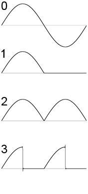

# Tutorial YM3812 (OPL2)

This is a simple introduction tutorial for people new to device-driver.
It covers the basics of registers, blocks, interfaces and repeats.

## Background

It's hard to make computer make sounds and music. Or at least, it used to. The early personal computers of the late 70's and early 80's either couldn't make sounds or only had a little PC speaker, the one that beeps when you boot a computer.

Later on, mostly for games, companies started creating more capable sound cards. You could plug them in your PC like you do a graphics card.

The chip we're going to look at, the OPL2, is a famous chip from that time. It can't play samples and only has 9 channels with which to make sounds. But those channels can all be configured individually with two operators which can perform 'FM synthesis'.

The OPL2 could be found on two sound cards: The AdLib from 1987 and the Sound Blaster from 1989.


Want to know what computers sounded like back then? Then listen to this video. The OPL2 is the third variant shown, starting at 3:08.

<iframe width="100%" style="aspect-ratio: 16 / 9;" src="https://www.youtube-nocookie.com/embed/Fr-84mjV3CI?si=Dt2D8GgQDl_A_y-C" title="YouTube video player" frameborder="0" allow="accelerometer; autoplay; clipboard-write; encrypted-media; gyroscope; picture-in-picture; web-share" referrerpolicy="strict-origin-when-cross-origin" allowfullscreen></iframe>

## Examining the hardware

### Finding docs

First we need to know what we're dealing with and find some documentation for the chip. This isn't as easy as with modern chips, but luckily this chip is and was liked by hobbyists. There's a website dedicated to OPL hardware: [oplx.com](https://www.oplx.com/opl2.htm).

On it we can find the following text file: [adlib_sb.txt](../assets/adlib_sb.txt).
It's from someone in 1992 noticing people don't have good docs and deciding he would fix that. So thank you Jeffrey S. Lee for the early open source spirit!

This document is made for people using soundblaster cards in their PCs. But I don't have such a card and even if I did, it wouldn't fit. Instead I have an earlier version of [this board](https://www.tindie.com/products/cheerful/opl2-audio-board/). Instead of having a parallel interface, there's a shift register so we can use SPI to communicate with the board.

Now that we have all the resources we need, we can get started!

### How does the chip work?

The OPL2 can't make audio like we're used to today. Modern audio devices can play samples that resemble the audio waves in the air which the device tries to recreate.

But these old devices aren't capable of that, it was simply too advanced. Instead the OPL2 have multiple operators that can only make the following simple wave forms:



Later iterations of the OPL have more wave forms.

Luckily there's all kinds of settings with which to edit these wave forms to make them more interesting. This tutorial isn't about that though, so if you want to know more, this website has a nice overview and audio samples: [cosmodoc.org/topics/adlib-functions](https://cosmodoc.org/topics/adlib-functions/).

> [!IMPORTANT]
> For us what's most important to know now is that this chip has 9 channels with 2 operators each. Those channels can output the additive result of those 2 operators or they can be used for [FM synthesis](https://en.wikipedia.org/wiki/Frequency_modulation_synthesis).

### Register layout

The documentation we found helpfully lays out an overview of all registers:

```txt
{{#include ../assets/adlib_sb.txt:121:136}}
```

We can notice there are three kinds of registers:
1. Single registers
2. Repeated registers 0..=8
3. Repeated registers 0..=21 (0x15)

The single registers are for global settings. The 9 repeated registers are one for each channel, which makes sense. But the registers that are repeated 22 times? Well, that's where the chip is a little weird. These are for the operators, except there are only 18 operators in total (2 per channel).

When we read on in the documentation we find this table:

```txt
{{#include ../assets/adlib_sb.txt:138:149}}
```

This is annoying, but we'll have to deal with it.

### The interface

The board I have with the shift register doesn't really spell out how to use it. But you can look at the code the author provided to see what has to happen.

Basically we have 4 relevant pins to use when writing data to the chip (through the shift register):
| name  | function                                                                                                      |
| ----- | ------------------------------------------------------------------------------------------------------------- |
| Data  | The bit value we're shifting in                                                                               |
| Shift | The clock signal. When transitioning from low to high, the value of the Data pin is shifted in.               |
| Latch | When the latch is pulled low for 1us, the shifted in data is applied to the parallel bus.                     |
| A0    | When low, the data on the bus is seen as the address. When high the data on the bus is seen as register data. |

First the address needs to be written, then you must wait 4us, then the data needs to be written and then you must wait 23us.

## Writing the driver

### DDSL

First we create a file named `ym3812.ddsl` (or something else to your liking). Then we write the basic setup:

```ddsl
device Ym3812 {
    register-address-type: u8,
}
```

With this we've told the compiler there's a [`device`](./language-device.md) and that it uses `u8` as the address type for registers. Luckily that's all the settings we need already out of the way, so we can continue with writing the registers.

#### Global registers

Let's start simple and do the global registers first.
There's no good names given to these registers, so we'll have to be a bit creative ourselves.

The docs for the first register is here:
```txt
{{#include ../assets/adlib_sb.txt:172:179}}
```

We can notice it's located at address 1, is 1 byte in size and only uses bit 5.

In device-driver, this data is encoded with two objects: a [`register`](./language-register.md) and a [`fieldset`](./language-fieldset.md). The fieldset describes the data of the register and the register describes how it relates to the device.

Let's define them in ddsl:
```ddsl
/// Register containing the Waveform Select Enable and some test fields
register Enable_waveform_control {
    address: 0x01,
    fields: Enable_waveform_control,
},
fieldset Enable_waveform_control {
    size-bytes: 1,
    /// If clear, all channels will use normal sine wave.
    /// If set, register E0-F5 (Waveform Select) contents will be used.
    field WS 5 -> bool,
}
```

As you can see, we've defined the objects and put some doc comments on them too.
The generated code will contain those docs as well, so they're visible in your code editor.

The register and fieldset use the same name. This is allowed and they don't clash.
That's because there's separate [namespacing](./language.html#namespacing) for operations and types.
However, having to define two objects for every device register is a bit bloated. To help with that, we can define the fieldset inline in the fields property of the register:

```ddsl
/// Register containing the Waveform Select Enable and some test fields
register Enable_waveform_control {
    address: 0x01,
    fields: fieldset _ {
        size-bytes: 1,
        /// If clear, all channels will use normal sine wave.
        /// If set, register E0-F5 (Waveform Select) contents will be used.
        field WS 5,
    },
},
```

That's much more concise! There are two additional change you may notice that use two different `auto` features:
1. We don't specify the fieldset name and use an underscore. When defining inline types, this can be used so the type takes on the name of the node it's being defined in.
2. We don't specify the field is a bool anymore. This is the same as if we wrote `field WS 5 -> _`. There are some rules about what the so-called base type of the field will become (in order):
   - If the field contains a conversion (we'll see that later in the tutorial), it will take on the base type of the conversion target.
   - If the field is 1 bit in size, it will become a `bool`.
   - If the field is multiple bits, it will becoma a `uint`. (The `uint` will then become the smallest sized integer that fits the number of bits. So a `uint` with 11 bits becomes a `u16`)

Alright, next register:
```txt
{{#include ../assets/adlib_sb.txt:182:187}}
```

This one is more boring, so let's just define it:
```ddsl
register Timer_1_Data {
    address: 0x02,
    fields: fieldset _ {
        size-bytes: 1,
        field value 7:0,
    }
},
```

`7:0` is the bit range. It's high to low and it's an inclusive range. Again we don't specify the base type of the value field,
so it'll become a u8 in this case.

Let's skip some of the registers that you should be able to define yourself already and go to the last global register that uses some new features:
```txt
{{#include ../assets/adlib_sb.txt:379:397}}
```

All these fields *could* be bools. But that would be confusing for the fields that aren't simple on/off fields.
The other fields encode a *value* that's distinct from true/false. So ideally we encode those values in a way so the user of our driver knows what they mean without looking at the documentation.

Luckily we can do that using [`enum`](./language-enum.md)s! And once again, we can define and use them inline.

```ddsl
register rhythm_settings {
    address: 0xBD,
    fields: fieldset _ {
        size-bytes: 1,
        /// Tremolo (Amplitude Vibrato) Depth.
        field tremolo_depth 7 -> _ as enum _ {
            /// 1.0dB
            Low: 0b0,
            /// 4.8dB
            High: 0b1,
        },
        /// Frequency Vibrato Depth. A "cent" is 1/100 of a semi-tone.
        field vibrato_depth 6 -> _ as enum _ {
            /// 7 cents
            Low: 0b0,
            /// 14 cents
            High: 0b1,
        },
        field instrument_mode 5 -> _ as enum _ {
            Melodic: 0b0,
            Percussion: 0b1,
        },
        field bass_drum_on 4,
        field snare_drum_on 3,
        field tom_tom_on 2,
        field cymbal_on 1,
        field hi_hat_on 0,
    }
}
```

The first three fields use the optional conversion syntax of the [type specifier](./language-tokens_ast.html#type-specifier). The enums will have the same names as the fields.

Here we can use `infallible` conversion, which is always recommended when possible. But there exist situations where the enum can't cover all possible bit patterns, at which point `fallible` conversion must be used. That would look like this:
```ddsl
field foo 0 -> _ as try enum _ { }
//                  +++
```

#### Channel settings

#### Operator settings

### Rust crate

#### Setting up dependencies

#### Using the macro

#### Creating the interface

## Using the driver

### Example from docs

### Our own instruments
