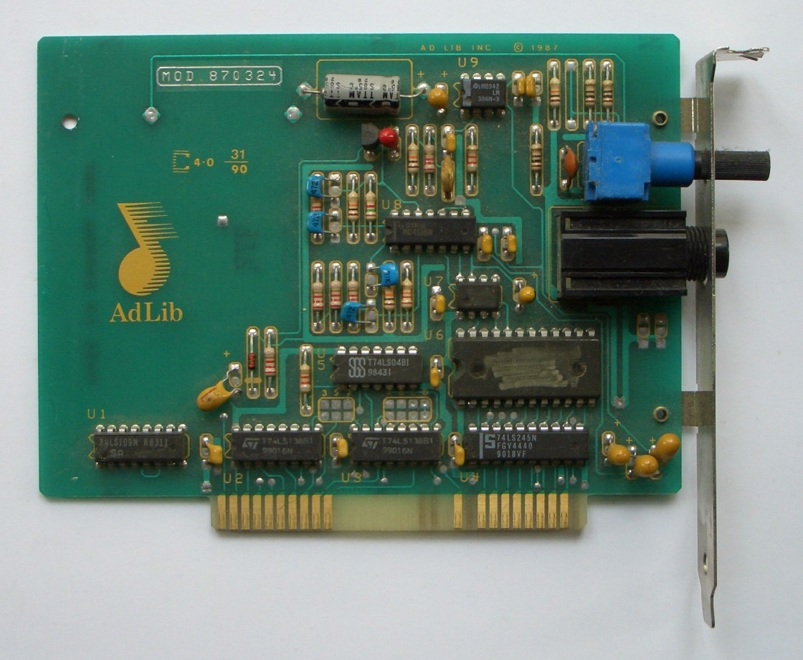

# Tutorial YM3812 (OPL2)

This is a simple introduction tutorial for people new to device-driver.
It covers the basics of registers, blocks, interfaces and repeats.

## Background

It's hard to make computer make sounds and music. Or at least, it used to. The early personal computers of the late 70's and early 80's either couldn't make sounds or only had a little PC speaker, the one that beeps when you boot a computer.

Later on, mostly for games, companies started creating more capable sound cards. You could plug them in your PC like you do a graphics card.

The chip we're going to look at, the OPL2, is a famous chip from that time. It can't play samples and only has 9 channels with which to make sounds. But those channels can all be configured individually with two operators which can perform 'FM synthesis'.

The OPL2 could be found on two sound cards: The AdLib from 1987 and the Sound Blaster from 1989.

Want to know what computers sounded like back then? Then listen to this video. The OPL2 is the third variant shown, starting at 3:08.

<iframe width="100%" style="aspect-ratio: 16 / 9;" src="https://www.youtube-nocookie.com/embed/Fr-84mjV3CI?si=Dt2D8GgQDl_A_y-C" title="YouTube video player" frameborder="0" allow="accelerometer; autoplay; clipboard-write; encrypted-media; gyroscope; picture-in-picture; web-share" referrerpolicy="strict-origin-when-cross-origin" allowfullscreen></iframe>

## Examining the hardware

First we need to know what we're dealing with.

https://www.oplx.com/opl2/docs/adlib_sb.txt