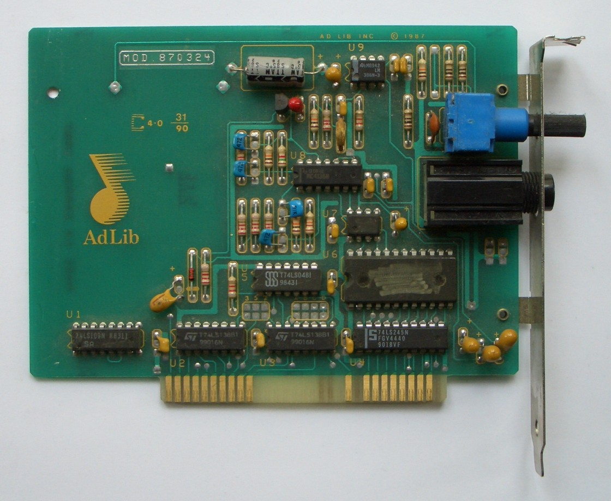
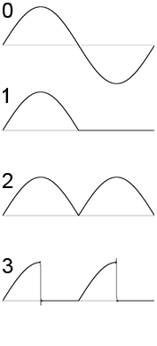

# Tutorial YM3812 (OPL2)

This is a simple introduction tutorial for people new to device-driver.
It covers the basics of registers, blocks, interfaces and repeats.

## Background

It's hard to make computer make sounds and music. Or at least, it used to. The early personal computers of the late 70's and early 80's either couldn't make sounds or only had a little PC speaker, the one that beeps when you boot a computer.

Later on, mostly for games, companies started creating more capable sound cards. You could plug them in your PC like you do a graphics card.

The chip we're going to look at, the OPL2, is a famous chip from that time. It can't play samples and only has 9 channels with which to make sounds. But those channels can all be configured individually with two operators which can perform 'FM synthesis'.

The OPL2 could be found on two sound cards: The AdLib from 1987 and the Sound Blaster from 1989.



Want to know what computers sounded like back then? Then listen to this video. The OPL2 is the third variant shown, starting at 3:08.

<iframe width="100%" style="aspect-ratio: 16 / 9;" src="https://www.youtube-nocookie.com/embed/Fr-84mjV3CI?si=Dt2D8GgQDl_A_y-C" title="YouTube video player" frameborder="0" allow="accelerometer; autoplay; clipboard-write; encrypted-media; gyroscope; picture-in-picture; web-share" referrerpolicy="strict-origin-when-cross-origin" allowfullscreen></iframe>

## Examining the hardware

### Finding docs

First we need to know what we're dealing with and find some documentation for the chip. This isn't as easy as with modern chips, but luckily this chip is and was liked by hobbyists. There's a website dedicated to OPL hardware: [oplx.com](https://www.oplx.com/opl2.htm).

On it we can find the following text file: [adlib_sb.txt](../assets/adlib_sb.txt).
It's from someone in 1992 noticing people don't have good docs and deciding he would fix that. So thank you Jeffrey S. Lee for the early open source spirit!

This document is made for people using soundblaster cards in their PCs. But I don't have such a card and even if I did, it wouldn't fit. Instead I have an earlier version of [this board](https://www.tindie.com/products/cheerful/opl2-audio-board/). Instead of having a parallel interface, there's a shift register so we can use SPI to communicate with the board.

Now that we have all the resources we need, we can get started!

### How does the chip work?

The OPL2 can't make audio like we're used to today. Modern audio devices can play samples that resemble the audio waves in the air which the device tries to recreate.

But these old devices aren't capable of that, it was simply too advanced. Instead the OPL2 have multiple operators that can only make the following simple wave forms:



Later iterations of the OPL have more wave forms.

Luckily there's all kinds of settings with which to edit these wave forms to make them more interesting. This tutorial isn't about that though, so if you want to know more, this website has a nice overview and audio samples: [cosmodoc.org/topics/adlib-functions](https://cosmodoc.org/topics/adlib-functions/).

> [!IMPORTANT]
> For us what's most important to know now is that this chip has 9 channels with 2 operators each. Those channels can output the additive result of those 2 operators or they can be used for [FM synthesis](https://en.wikipedia.org/wiki/Frequency_modulation_synthesis).

### Register layout

The documentation we found helpfully lays out an overview of all registers:

```txt
{{#include ../assets/adlib_sb.txt:121:136}}
```

We can notice there are three kinds of registers:
1. Single registers
2. Repeated registers 0..=8
3. Repeated registers 0..=21 (0x15)

The single registers are for global settings. The 9 repeated registers are one for each channel, which makes sense. But the registers that are repeated 22 times? Well, that's where the chip is a little weird. These are for the operators, except there are only 18 operators in total (2 per channel).

When we read on in the documentation we find this table:

```txt
{{#include ../assets/adlib_sb.txt:138:149}}
```

This is annoying, but we'll have to deal with it.

### The interface

The board I have with the shift register doesn't really spell out how to use it. But you can look at the code the author provided to see what has to happen.

Basically we have 4 relevant pins to use when writing data to the chip (through the shift register):
| name  | function                                                                                                      |
| ----- | ------------------------------------------------------------------------------------------------------------- |
| Data  | The bit value we're shifting in                                                                               |
| Shift | The clock signal. When transitioning from low to high, the value of the Data pin is shifted in.               |
| Latch | When the latch is pulled low for 1us, the shifted in data is applied to the parallel bus.                     |
| A0    | When low, the data on the bus is seen as the address. When high the data on the bus is seen as register data. |

First the address needs to be written, then you must wait 4us, then the data needs to be written and then you must wait 23us.

## Writing the driver

### DDSL

First we create a file named `ym3812.ddsl` (or something else to your liking). Then we write the basic setup:

```ddsl
device Ym3812 {
    register-address-type: u8,
}
```

With this we've told the compiler there's a [`device`](./language-device.md) and that it uses `u8` as the address type for registers. Luckily that's all the settings we need already out of the way, so we can continue with writing the registers.

#### Global registers

Let's start simple and do the global registers first.
There's no good names given to these registers, so we'll have to be a bit creative ourselves.

The docs for the first register is here:
```txt
{{#include ../assets/adlib_sb.txt:172:179}}
```

We can notice it's located at address 1, is 1 byte in size and only uses bit 5.

In device-driver, this data is encoded with two objects: a [`register`](./language-register.md) and a [`fieldset`](./language-fieldset.md). The fieldset describes the data of the register and the register describes how it relates to the device.

Let's define them in ddsl:
```ddsl
device Ym3812 {
    register-address-type: u8,

    /// Register containing the Waveform Select Enable and some test fields
    register Enable_waveform_control {
        address: 0x01,
        fields: Enable_waveform_control,
    },
    fieldset Enable_waveform_control {
        size-bytes: 1,
        /// If clear, all channels will use normal sine wave.
        /// If set, register E0-F5 (Waveform Select) contents will be used.
        field WS 5 -> bool,
    }
}
```

As you can see, we've defined the objects and put some doc comments on them too.
The generated code will contain those docs as well, so they're visible in your code editor.

The register and fieldset use the same name. This is allowed and they don't clash.
That's because there's separate [namespacing](./language.html#namespacing) for operations and types.
However, having to define two objects for every device register is a bit bloated. To help with that, we can define the fieldset inline in the fields property of the register:

```ddsl
/// Register containing the Waveform Select Enable and some test fields
register Enable_waveform_control {
    address: 0x01,
    fields: fieldset _ {
        size-bytes: 1,
        /// If clear, all channels will use normal sine wave.
        /// If set, register E0-F5 (Waveform Select) contents will be used.
        field WS 5,
    },
},
```

That's much more concise! There are two additional changes you may notice that use two different `auto` features:
1. We don't specify the fieldset name and use an underscore. When defining inline types, this can be used to make the type take on the name of the node it's being defined in.
2. We don't specify the field is a bool anymore. This is the same as if we wrote `field WS 5 -> _`. There are some rules about what the so-called base type of the field will become (in order):
   - If the field contains a conversion (we'll see that later in the tutorial), it will take on the base type of the conversion target.
   - If the field is 1 bit in size, it will become a `bool`.
   - If the field is multiple bits, it will become a `uint`. (The `uint` will then become the smallest sized integer that fits the number of bits. So a `uint` with 11 bits becomes a `u16`)

Alright, next register:
```txt
{{#include ../assets/adlib_sb.txt:182:187}}
```

This one is more boring, so let's just define it:
```ddsl
register Timer_1_Data {
    address: 0x02,
    fields: fieldset _ {
        size-bytes: 1,
        field value 7:0,
    }
},
```

`7:0` is the bit range. It's high to low and it's an inclusive range. Again we don't specify the base type of the value field,
so it'll become a u8 in this case.

Let's skip some of the registers that you should be able to define yourself already now and go to the last global register that uses some new features:
```txt
{{#include ../assets/adlib_sb.txt:379:397}}
```

All these fields *could* be bools. But that would be confusing for the fields that aren't simple on/off fields.
The other fields encode a *value* that's distinct from true/false. So ideally we encode those values in a way so the user of our driver knows what they mean without looking at the documentation.

Luckily we can do that using [`enum`](./language-enum.md)s! And once again, we can define and use them inline.

```ddsl
register rhythm_settings {
    address: 0xBD,
    fields: fieldset _ {
        size-bytes: 1,
        /// Tremolo (Amplitude Vibrato) Depth.
        field tremolo_depth 7 -> _ as enum _ {
            /// 1.0dB
            Low: 0b0,
            /// 4.8dB
            High: 0b1,
        },
        /// Frequency Vibrato Depth. A "cent" is 1/100 of a semi-tone.
        field vibrato_depth 6 -> _ as enum _ {
            /// 7 cents
            Low: 0b0,
            /// 14 cents
            High: 0b1,
        },
        field instrument_mode 5 -> _ as enum _ {
            Melodic: 0b0,
            Percussion: 0b1,
        },
        field bass_drum_on 4,
        field snare_drum_on 3,
        field tom_tom_on 2,
        field cymbal_on 1,
        field hi_hat_on 0,
    }
}
```

The first three fields use the optional conversion syntax of the [type specifier](./language-tokens_ast.html#type-specifier). The enums will have the same names as the fields.

Here we can use `infallible` conversion, which is always recommended when possible. But there exist situations where the enum can't cover all possible bit patterns, at which point `fallible` conversion must be used. That would look like this:
```ddsl
field foo 0 -> _ as try enum _ { }
//                  +++
```

#### Channel settings

There are 3 registers per channel we need to be able to program.
These control the frequency, whether they're on or off and how the two operators are connected.

We could define each individually and that'd work ok. But we're in the business of providing the best API to our users as possible. So we're going to combine two powerful features: [`repeats`](./language-tokens_ast.md#repeat) and [`blocks`](./language-block.md).

##### Repeats

A repeat can be used to, well, repeat an object multiple times. It's kind of like an array, so much so that the syntax looks like it too.

We can define a repeat using brackets, like this:
```ddsl
register foo[4 stride 2] { ... }
```
Here we've defined a register that is repeated four times. And with each repeat, the address is incremented by two. So if the start address is 10, then this register is present on addresses 10, 12, 14 and 16.

Repeats can use enums too instead of a length:
```ddsl
enum bar { a: 2, b: 3, c: 5, d: 7 },
register foo[bar stride 2] { ... }
```

This is incredibly useful for when there are gaps in the index.
The stride is a multiplier on the values of the enum.

##### Blocks

A block is an object that groups subobjects together. And that's very useful in our case because we can group the channel settings together.

```ddsl
block foo {
    address-offset: 10,

    register bar {
        address: 10,
        // ...
    },
    register quux {
        address: 11,
        // ...
    }
}
```
Here we see registers `bar` and `quux` are part of block `foo`.
Important to know is that the block can specify an address offset which is then added to all child objects. So in reality `bar` and `quux` have addresses 20 and 21. It's up to you to decide what makes sense. You can always set the offset to 0 if you want to use the global addresses.

##### Combined

For the driver we're writing, we could do a repeat on every channel register.
But instead let's do the repeat on a block and put all channels settings in that block.
That way it's nice and organized. Here's how it could be modeled (with some added comments for explanations):

```ddsl
enum Channel {
    C1: _, // Use auto assignment. This starts at 0
    C2: _, // This variant is auto-assigned value 1
    C3: _, // 2
    C4: _,
    C5: _,
    C6: _,
    C7: _,
    C8: _,
    C9: _,
},

block ChannelGeneralSettings[Channel stride 1] {
    //                      ^^^^^^^^^^^^^^^^^^
    // Create the block with the channel enum as the repeat
    // Each channel should offset the registers by 1, so we pick a stride of 1

    // Let's not add a block offset so we can keep using the global addresses
    // That simply makes most sense in this case
    address-offset: 0,

    register channel_settings0 {
        address: 0xA0,
        fields: fieldset _ {
            size-bytes: 1,
            field frequency_number_lsb 7:0,
        }
    },
    register channel_settings1 {
        address: 0xB0,
        fields: fieldset _ {
            size-bytes: 1,
            /// Channel is voiced when set, silent when clear.
            field key_on 5,
            /// Octave (0-7). 0 is lowest, 7 is highest.
            field block_number 4:2,
            field frequency_number_high 1:0,
        }
    },
    register channel_settings2 {
        address: 0xC0,
        fields: fieldset _ {
            size-bytes: 1,
            /// Feedback strength.  If all three bits are set to
            /// zero, no feedback is present.  With values 1-7,
            /// operator 1 will send a portion of its output back
            /// into itself.  1 is the least amount of feedback,
            /// 7 is the most.
            field feedback 3:1,
            field synthesis_type 0 -> _ as
                /// How the operators interact.
                /// Complex sounds are more easily created
                /// if the algorithm is set to FrequencyModulation.
                enum SynthesisType {
                    /// Operator 1 modulates operator 2.
                    /// In this case, operator 2 is the only one producing sound.
                    FrequencyModulation: 0b0,
                    /// Both operators produce sound directly.
                    AdditiveSynthesis: 0b1,
                },
        }
    },
},
```

Note how the `SynthesisType` has doc comments on a newline. That's how you add a description to inline objects.

#### Operator settings

The way the operator settings are done, is a little crazy on this chip. Even the documentation we have calls that out!

Remember, every channel has two operators.

```txt
{{#include ../assets/adlib_sb.txt:138:149}}
```

The channels have gaps in them and the second operator is always the first operator plus 3.

So, let's use the same trick with the block and repeat again:

```ddsl
/// Enum to select the channel for the operator settings block
enum ChannelOperators {
    C1: 0x00,
    C2: 0x01,
    C3: 0x02,
    C4: 0x08,
    C5: 0x09,
    C6: 0x0A,
    C7: 0x10,
    C8: 0x11,
    C9: 0x12,
},
/// Each channel has two operators
enum Operator {
    O1: 0,
    O2: 1, // We could pick 3 (stride 1) or 1 (stride 3)
           // But this makes most logical sense
},
```

Then we use these to create the block with the operator registers.
I'll omit the register details since those clutter the code for this example.

Different from the channel settings is that we need to have two repeats.
To be consistent, we'll use the channel repeat on the block and then for each register we'll have a repeat to select the operator for that channel.

```ddsl
/// Block containing all operator settings for a channel
block ChannelOperatorSettings[ChannelOperators stride 1] {
    //                       ^^^^^^^^^^^^^^^^^^^^^^^^^^^

    address-offset: 0,

    register operator_settings0[Operator stride 3] {
        //                     ^^^^^^^^^^^^^^^^^^^
        address: 0x20,
        fields: fieldset _ {
            // ...
        }
    },
    register operator_settings1[Operator stride 3] {
        address: 0x40,
        fields: fieldset _ {
            // ...
        }
    },
    register operator_settings2[Operator stride 3] {
        address: 0x60,
        fields: fieldset _ {
            // ...
        }
    },
    register operator_settings3[Operator stride 3] {
        address: 0x80,
        fields: fieldset _ {
            // ...
        }
    },
    register operator_settings4[Operator stride 3] {
        address: 0xE0,
        fields: fieldset _ {
            // ...
        }
    },
},
```

And that's it for the DDSL code! We can now actually start using it.

### Rust crate

Let's turn this all into a driver we can use from Rust!

The best way to do it, is to make it into its own crate. We want to make it usable for embedded use, so we'll make it no-std and to make it portable, we'll use the embedded-hal traits.

#### Setting up the crate

We can make a crate using cargo:

```sh
cargo new ym3812 --lib
cd ym3812
```

There's two styles in which we can architect the crate:
- Using the device-driver compile macro
  - This is the easiest way to use device-driver and makes sense during development
  - Downside is that the device-driver compiler becomes a dependency
- Using the cli to generate rust code ahead of time
  - When you're done with your driver and ready to publish, you might want to convert your crate to this style
  - Downside is that it's a little more setup and your generated rust code can be out of sync with your ddsl

For this tutorial, we'll set up for using the compile macro.

Now that we've got our crate, we should do a couple of things:
- Place our ddsl file in the crate root. Let's call it `ym3812.ddsl`, but you can call it anything.
- Add the required dependencies:
  ```sh
  # The macros feature enables the compile macro
  cargo add device-driver --features macros
  cargo add embedded-hal
  # Only required for async drivers
  cargo add embedded-hal-async
  ``` 
- Add a build script. This will make sure the crate will be recompiled when the ddsl is changed:
  ```rust
  fn main() {
      println!("cargo:rebuild-if-changed=ym3812.ddsl");
  }
  ```

#### Using the macro

Typically I like to make a separate module to put the driver definitions in and call it something like `ll` for low-level.
So let's do that!

```rust
// lib.rs

mod ll;
```

To compile the ddsl code, simply use the compile macro:
```rust
// ll.rs

device_driver::compile!(
    manifest: "ym3812.ddsl",
);
```

This will put all of the generated code at the site of the macro call.


#### Creating the interface

Device-driver doesn't know how to talk with the device, so we need to teach it that.
With Rust we've got traits for it!

Every type of operation has its own traits. We've only defined registers, so we only need to implement the `RegisterInterface` and/or `AsyncRegisterInterface` for the interface type we're going to make.

If the blocking version is implemented, then blocking register reads and writes will be supported. Same with the async version. For this tutorial we'll only implement the async version.

Our interface is just a struct, so let's create it with all the IO it needs:
```rust
// ll.rs

use embedded_hal::digital::OutputPin;
use embedded_hal_async::{delay::DelayNs, spi::SpiBus};

/// Our hardware interface with the chip using the shift register that
/// is present on the opl2 audio board by Maarten Janssen
pub struct ShiftInterface<SPI, A, L, R, D>
where
    SPI: SpiBus,
    A: OutputPin,
    L: OutputPin,
    R: OutputPin,
    D: DelayNs,
{
    /// The spi interface we use to drive the shift register
    spi: SPI,
    /// The pin connected to the A0 input
    address_pin: A,
    /// The pin connected to the latch input of the shift register
    latch_pin: L,
    /// The pin connected to the reset input
    reset_pin: R,
    /// Some kind of delay provider
    delay: D,
    /// A copy of all the registers in memory.
    ///
    /// We need this because we can't read the OPL registers.
    /// By keeping track of this ourselves, we can still present
    /// a read/write interface which is useful for modifying registers.
    registers: [u8; u8::MAX as usize],
}
```

Now that we have our shift interface, we can start implementing the traits we need.
First off is the base trait that defines address type and the error type. The address type must be the same as the one we set up in the ddsl code.

```rust
// ll.rs

use device_driver::RegisterInterfaceBase;

#[derive(Debug)]
pub enum InterfaceError {
    AddressPinError,
    LatchPinError,
    ResetPinError,
    CommunicationError,
}

impl<SPI: SpiBus, A: OutputPin, L: OutputPin, R: OutputPin, D: DelayNs> RegisterInterfaceBase
    for ShiftInterface<SPI, A, L, R, D>
{
    type Error = InterfaceError;
    type AddressType = u8;
}
```

Now we're ready to implement the main trait. This will look very different for almost every device. The requirements here have been discussed earlier in the tutorial.

Normally devices have sections in their datasheets about how the communication with the device work.

```rust
// ll.rs

impl<SPI: SpiBus, A: OutputPin, L: OutputPin, R: OutputPin, D: DelayNs> AsyncRegisterInterface
    for ShiftInterface<SPI, A, L, R, D>
{
    async fn write_register(
        &mut self,
        address: Self::AddressType,
        data: &mut [u8],
        _metadata: &device_driver::FieldsetMetadata,
    ) -> Result<(), Self::Error> {
        // We know we've always got one byte since all registers are that size
        let byte = data[0];

        // Save in internal data store
        self.registers[address as usize] = byte;

        // Send the address
        self.address_pin
            .set_low()
            .map_err(|_| Self::Error::AddressPinError)?;

        self.spi
            .write(&[address])
            .await
            .map_err(|_| Self::Error::CommunicationError)?;

        // Apply the shift latch
        self.latch_pin
            .set_low()
            .map_err(|_| Self::Error::LatchPinError)?;
        self.delay.delay_us(1).await;
        self.latch_pin
            .set_high()
            .map_err(|_| Self::Error::LatchPinError)?;
        self.delay.delay_us(4).await;

        // Send the data
        self.address_pin
            .set_high()
            .map_err(|_| Self::Error::AddressPinError)?;

        self.spi
            .write(&[byte])
            .await
            .map_err(|_| Self::Error::CommunicationError)?;

        // Apply the shift latch
        self.latch_pin
            .set_low()
            .map_err(|_| Self::Error::LatchPinError)?;
        self.delay.delay_us(1).await;
        self.latch_pin
            .set_high()
            .map_err(|_| Self::Error::LatchPinError)?;
        self.delay.delay_us(23).await;

        Ok(())
    }

    async fn read_register(
        &mut self,
        address: Self::AddressType,
        data: &mut [u8],
        _metadata: &device_driver::FieldsetMetadata,
    ) -> Result<(), Self::Error> {
        data[0] = self.registers[address as usize];
        Ok(())
    }
}
```

Let's add some convenience methods too for construction and resetting the device.

```rust
// ll.rs

impl<SPI: SpiBus, A: OutputPin, L: OutputPin, R: OutputPin, D: DelayNs>
    ShiftInterface<SPI, A, L, R, D>
{
    pub const fn new(spi: SPI, address_pin: A, latch_pin: L, reset_pin: R, delay: D) -> Self {
        Self {
            spi,
            address_pin,
            latch_pin,
            reset_pin,
            delay,
            registers: [0; _],
        }
    }

    pub async fn reset(&mut self) -> Result<(), InterfaceError> {
        // Set the pins to the default level
        self.latch_pin
            .set_high()
            .map_err(|_| InterfaceError::LatchPinError)?;
        self.reset_pin
            .set_high()
            .map_err(|_| InterfaceError::ResetPinError)?;
        self.address_pin
            .set_low()
            .map_err(|_| InterfaceError::AddressPinError)?;

        // Make a reset cycle
        self.reset_pin
            .set_low()
            .map_err(|_| InterfaceError::ResetPinError)?;
        self.delay.delay_ms(1).await;
        self.reset_pin
            .set_high()
            .map_err(|_| InterfaceError::ResetPinError)?;

        // Reset the internal registers
        self.registers = [0x00; 0xFF];
        self.write_register(0x00, &mut [0x00; 0xFF], &FieldsetMetadata::DEFAULT)
            .await?;

        Ok(())
    }
}
```

With that we've done all the setup we need!

## Using the driver

Let's create an instance of the driver and explore how we can now use it.

```rust
// Create an instance of the interface we need to talk with the chip
// Get your SPI and gpio from your HAL
let interface = ShiftInterface::new(
    Spi::new_txonly(p.SPI1, p.PB3, p.PB5, p.DMA1_CH1, Irqs, config),
    Output::new(p.PB14, Level::Low, Speed::VeryHigh),
    Output::new(p.PC4, Level::Low, Speed::VeryHigh),
    Output::new(p.PD1, Level::Low, Speed::VeryHigh),
    embassy_time::Delay,
);

// Create the driver
let mut ym3812 = Ym3812::new(interface);
// Access the interface to call its reset function
ym3812.interface().reset().await?;
```

Now we know the device is in a good state (reset) and ready to use.

### Example from docs

Let's make a sound, that's the entire point after all.
Again, the guide helps us!

```txt
{{#include ../assets/adlib_sb.txt:448:476}}
```

So, let's replicate that using our new driver.
With device-driver we're not fiddling with bits manually, but use named methods. But since our source is specified in addresses and bits, we'll need to work backwards.

```rust
ym3812.enable_waveform_control()
    .write_async(|w| w.set_ws(true))
    .await
    .unwrap();

let mut operator_settings = ym3812.channel_operator_settings(ChannelOperators::C1);

// Set operator 1 settings

operator_settings
    .operator_settings_0()
    .write_at_async(Operator::O1, |reg| {
        reg.set_modulator_frequency_multiple(ModulatorFrequencyMultiple::AtSpecified)
    })
    .await?;
operator_settings
    .operator_settings_1()
    .write_at_async(Operator::O1, |reg| {
        reg.set_output_level(0x10);
    })
    .await?;
operator_settings
    .operator_settings_2()
    .write_at_async(Operator::O1, |reg| {
        reg.set_attack_rate(15);
        reg.set_decay_rate(0);
    })
    .await?;
operator_settings
    .operator_settings_3()
    .write_at_async(Operator::O1, |reg| {
        reg.set_sustain_level(7);
        reg.set_release_rate(7);
    })
    .await?;

// Set operator 2 settings

operator_settings
    .operator_settings_0()
    .write_at_async(Operator::O2, |reg| {
        reg.set_modulator_frequency_multiple(ModulatorFrequencyMultiple::AtSpecified)
    })
    .await?;
operator_settings
    .operator_settings_1()
    .write_at_async(Operator::O2, |reg| {
        reg.set_output_level(0);
    })
    .await?;
operator_settings
    .operator_settings_2()
    .write_at_async(Operator::O2, |reg| {
        reg.set_attack_rate(15);
        reg.set_decay_rate(0);
    })
    .await?;
operator_settings
    .operator_settings_3()
    .write_at_async(Operator::O2, |reg| {
        reg.set_sustain_level(7);
        reg.set_release_rate(7);
    })
    .await?;

// Set channel settings

let mut channel = ym3812.channel_general_settings(Channel::C1);

channel
    .channel_settings_0()
    .write_async(|reg| reg.set_frequency_number_lsb(0x98))
    .await?;
channel
    .channel_settings_1()
    .write_async(|reg| {
        reg.set_key_on(true);
        reg.set_frequency_number_high(1);
        reg.set_block_number(4);
    })
    .await?;

ym3812.interface().delay.delay_ms(1000).await;

ym3812.channel_general_settings(Channel::C1)
    .channel_settings_1()
    .modify_async(|reg| {
        reg.set_key_on(false);
    })
    .await?;
```

Cool, let's check if this actually works:

<audio controls src="../assets/OPL_beep.mp3" preload="metadata" style="width: 100%;"></audio>

It does!

We've got a working driver. Now the world, or at least this device, is our oyster.
From here you can extend your driver as you like. Setting each register every time is bothersome, so you might want to create some rust functions that take an instrument and set all the registers required for that instrument.

If you want to make music, you'll need to drive that too yourself, so you'll want to make some sort of sequencer.

Exactly how you structure that is up to you. Generally I've found it good practise to view the driver as we have now as a 'low level' driver which we can wrap with a 'high level' driver. That's similar to how a PAC and HAL relate on microcontrollers.

In the future, device-driver hopes to offer some more high level features. You'll have to stay tuned for that and/or peruse the issue tracker on github. Suggestions are always welcome too!

If you want to see how I tackled that, take a look here: [github](https://github.com/diondokter/ym3812/)

If things are unclear or could be improved for this tutorial, please send PRs, open issues or hit me up in the chatroom!

I'll leave you with the song that's played by the example through my terrible hacked up sequencer I made 6 years ago:

<audio controls src="../assets/OPL_mission_impossible.mp3" preload="metadata" style="width: 100%;"></audio>
